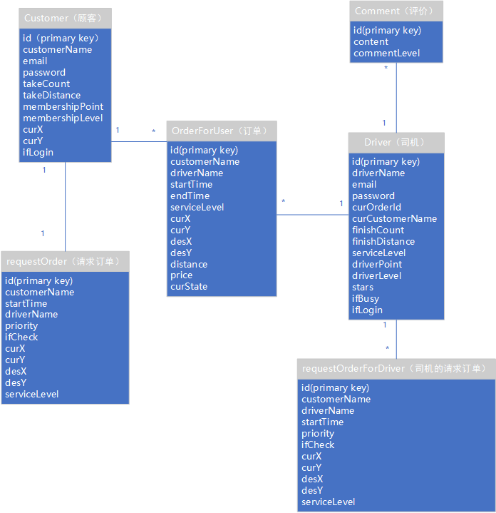
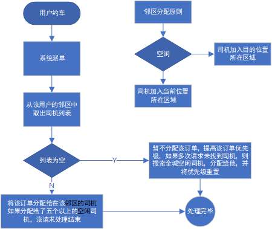
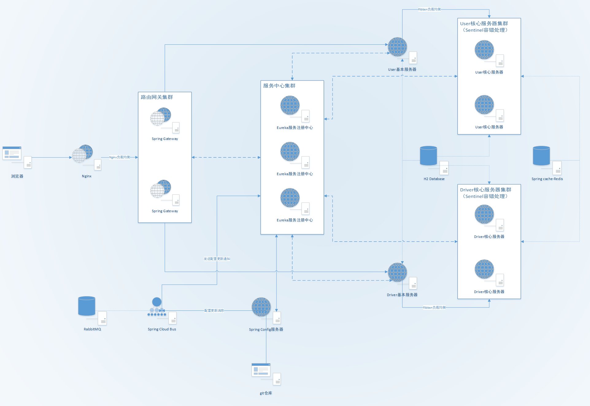
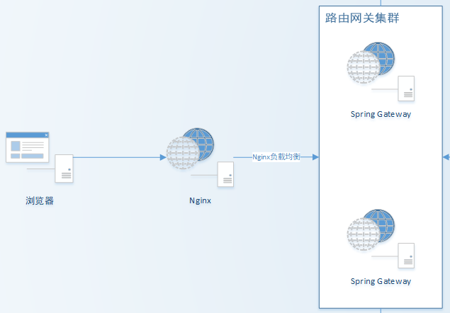
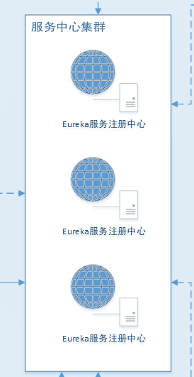
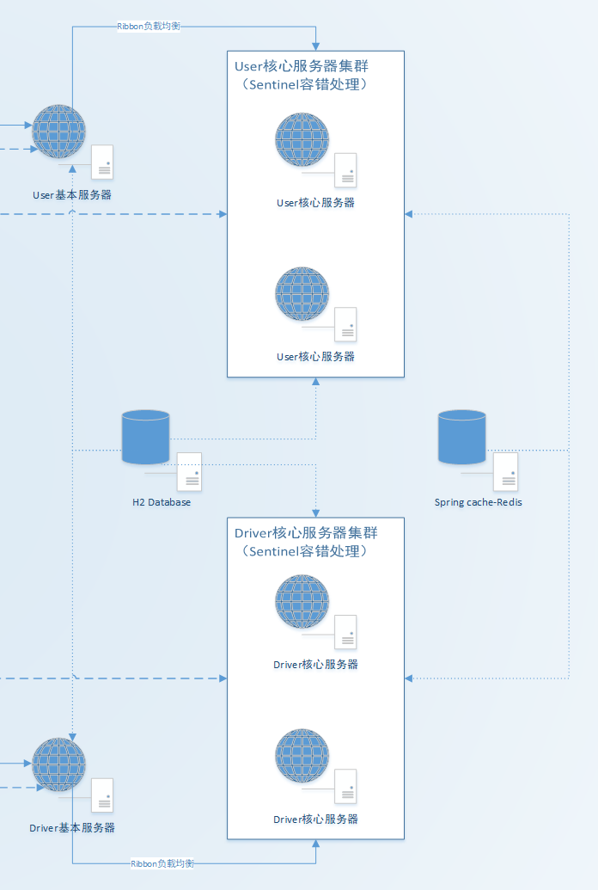
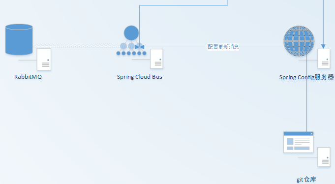
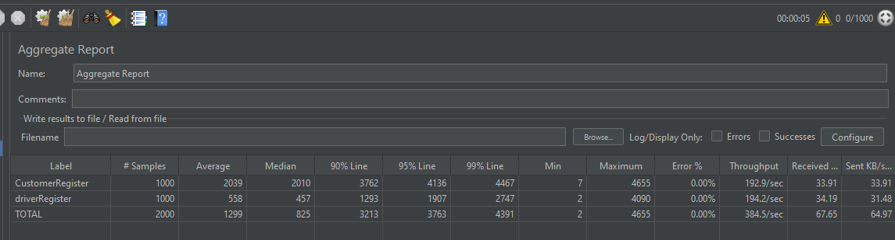
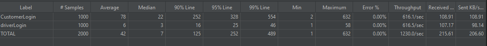
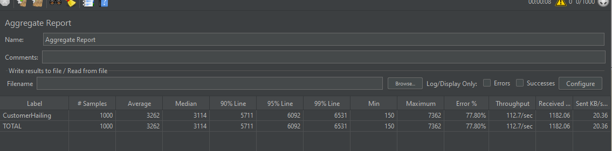

# Distributed-Online-Car-Hailing-Platform

北京邮电大学Web后端，分布式架构网约车平台后端原型系统设计与实现

|  姓名   | 学号  |
|  ----  | ----  |
| 凌国瀚  | 2018213344 |
| 连伟铭  | 2018211620 |

## 目录

<!-- TOC -->
> [需求分析](#一、需求分析)
>
>> [功能需求](#功能需求)
>>
>> [质量需求](#质量需求)
>
>[设计](#二、设计)
>
>> [业务逻辑设计](#业务逻辑设计)
>>
>>> [数据库实体设计](#数据库实体设计)
>>>
>>> [接口设计](#接口设计)
>>>
>>> [算法设计](#算法设计)
>>
>> [分布式架构设计](#分布式架构设计)
>>
>>> [路由网关集群](#路由网关集群)
>>>
>>> [服务中心集群](#服务中心集群)
>>>
>>> [核心业务服务集群](#核心业务服务集群)
>>>
>>> [配置管理集群](#配置管理集群)
>>
>
>[实现](#三、实现)
>
>> [业务逻辑实现](#业务逻辑实现)
>>
>> [分布式架构实现](#分布式架构实现)
>
>[测试与节点估算](#四、测试与节点估算)
>
>[问题分析](#五、问题分析)
>
>[心得体会](#六、心得体会)
<!-- /TOC -->

## 一、需求分析

### 功能需求

- 用户系统

包括普通用户和司机的注册、登录、退出。

- 会员积分

普通用户支持按照打车里程进行积分，并升级为不同的会员等级。

- 约车服务

司机可以设置开始/结束接单，用户可以发起/取消约车请求

- 派单服务

系统向距离用户较近的若干个司机发送约车信息，司机自行选择接单。

- 订单服务

用户上车后形成订单，用户到达目的地，司机提交费用，用户支付后订单结束，订单可查询

- 评价服务

用户可以查看接单司机的评价，在订单完成后可以对接单司机进行评价。

- 消息推送服务

系统向用户推送司机接单消息 系统向司机推送用户约单消息。

### 质量需求

- 系统规模

一年内注册用户数可达5000万，日均订单800万，高峰时段每小时200万订单。

- 分布式需求

可以通过扩展部署多台服务器的方式达到预期容量需求

- 用户体验

95%的用户请求响应时间不超过1秒钟

## 二、设计

### 业务逻辑设计

#### 数据库实体设计

实体设计较为简洁，包括顾客，请求订单，订单，司机，司机评价，司机请求订单。 顾客只有一个请求订单，可以有多个订单（订单列表）。 司机可有个司机评价，多个订单，多个请求订单。

<div align=center>



</div>

#### 接口设计

用户服务接口设计：[Interface-Customer](Interface-Customer.md)

司机服务接口设计：[Interface-Driver](Interface-Driver.md)

#### 算法设计

以下为本系统的约车派单算法。

该算法通过分区的方式，将司机分在城市不同区域内，该区域内的请求订单，将被首先分配给该区域内的司机，若分配给的空闲司机达到一定数量，将不再继续分配。若没有可分配的司机，则将分配范围扩大，具体算法流程如下。

<div align=center>



</div>

### 分布式架构设计

总体架构图如下：

<div align="center">



</div>

#### 路由网关集群

<div align="center">



</div>

该部分采用`Nginx + Spring Cloud Gateway`实现。

`Spring Cloud Gateway`主要功能是注册至服务中心集群，对外显示统一的网关，这解决也了 `Nginx` 和 `Spring` 服务节点之间无法直接交互的问题。同时，设置多个`Spring Cloud Gateway`
服务器节点形成集群（此处设置2个节点），以便 `Nginx` 进行流量的负载均衡。

`Nginx` 管理 **80** 端口，用户仅需使用 http 协议访问 `Nginx` 服务器的url便可以调用全部的服务。同时，`Nginx` 还配置了负载均衡、限流、防止爬虫攻击等功能。`Nginx` 的配置文件内容如下：

```nginx

#user  nobody;
worker_processes  1;

#error_log  logs/error.log;
#error_log  logs/error.log  notice;
error_log  logs/error.log  info;

#pid        logs/nginx.pid;


events {
    worker_connections  1024;
}


http {
    include       mime.types;
    default_type  application/octet-stream;

    log_format  main  '$remote_addr - $remote_user [$time_local] "$request" '
                     '$status $body_bytes_sent "$http_referer" '
                     '"$http_user_agent" "$http_x_forwarded_for"';

    sendfile        on;

    keepalive_timeout  65;

    gzip  on;

    upstream NginxLB{
        # 负载均衡两个Spring Gateway的网关，此处需要填写它们的url及端口
        server 127.0.0.1:7001 max_fails=3 fail_timeout=5s;
        server 127.0.0.1:7002 max_fails=3 fail_timeout=5s;
        ip_hash;
        # fair;
    }

    limit_req_zone $binary_remote_addr zone=one:10m rate=3r/s;  
    # 生成一个大小为10M，名字为one的内存区域，用来存储访问的频次信息
    # 允许相同标识的客户端的访问频次，这里限制的是每秒3次

    limit_conn_zone $binary_remote_addr zone=addr:10m;

    server {
        listen       80;
        server_name  localhost;

        charset utf-8;

        access_log  logs/host.access.log  main;

        location / {

            limit_req zone=one burst=7 nodelay; 
            # 设置一个大小为5的缓冲区。当有大量请求（爆发）过来时，超过了访问频次限制的请求可以先放到这个缓冲区内。
            # nodelay，如果设置，超过访问频次而且缓冲区也满了的时候就会直接返回503，如果没有设置，则所有请求会等待排队。

            limit_conn addr 10;
            # 一次只允许每个IP地址10个连接。

            root   html;
            index  index.html index.htm;
            proxy_pass http://NginxLB;
        }

        error_page   500 502 503 504  /50x.html;
        location = /50x.html {
            root   html;
        }

}
```

#### 服务中心集群

<div align="center">



</div>

利用`Spring Eureka`服务器作为服务注册管理中心，本系统所有`Spring Cloud`分布式服务节点都必须注册到该服务中心集群中，`Eureka`注册中心节点应当有3个。

#### 核心业务服务集群

<div align="center">



</div>

核心功能业务由该集群处理。首先通过目标用户，将服务拆分为 User 和 Driver 两大部分；根据业务的复杂程度，将服务再拆分为基本部分和核心部分。

服务的基本部分是指用户的登录、注册、登出、用户信息查询。服务的核心部分是指打车客户的打车请求、打车评价、司机的派单策略、消息队列等等复杂的功能模块。

服务的调用都仅需通过基本服务器即可，当调用核心服务器时，采用`Open Fegin + Ribbon`的方式进行服务间调用和服务间负载均衡。同时，利用`Spring cloud alibaba Sentinel`
对各个接口进行监控和容错保障（限流、降级等）。

数据持久化层部分，采用`H2 Database`数据库集群。同时在核心服务器部分，采用基于`Redis NoSQL`的`Spring cache`进行数据缓存，加快服务的访问速度。

#### 配置管理集群

<div align="center">



</div>

利用`Spring Cloud Config`配合[Git仓库](https://gitee.com/Kevin_Ling/spring-cloud-config-repo )，实现所有服务节点配置的集中管理。

同时，利用`Spring Cloud Bus`和消息中间件`RabbitMQ`配合Git仓库的`WebHook`（`WebHook`
暂未实现，因为需要公网IP），实现消息推送，使得当Git仓库配置更新后，各个服务节点的配置同步更新，而无需重启服务器以更新配置。

## 三、实现

### 业务逻辑实现

业务逻辑的具体实现可以查看程序模块[User-Prototype](User-Prototype)，该模块是本系统的单体式应用原型，业务逻辑和分布式系统中完全一致。

### 分布式架构实现

`Spring Cloud Gateway`路由网关集群：[Gateway](Gateway)

`Eureka`服务中心集群：[Eureka-Server](Eureka-Server)

User 基本服务器：[User-Server](User-Server)

User 核心服务器：[User-Hailing-Server](User-Hailing-Server)

Driver 基本服务器：[Driver-Server](Driver-Server)

Driver 核心服务器：[Driver-Hailing-Server](Driver-Hailing-Server)

`Spring Cloud Config/Spring Cloud Bus`配置管理集群：[Config-Server](Config-Server)

## 四、测试与节点估算

利用压力测试工具`Jmeter`对单体应用原型进行测试。不对分布式整体系统进行测试的原因在于我们硬件配置有限，仅有两台笔记本，而本项目完整的分布式系统包含数据持久层则至少需要15个服务节点，在两台机器上运行压力测试是不现实的。

因此我们计划对单体应用原型进行压力测试，利用得出的数据来估算当硬件配置足够时，分布式系统能否满足需求。

注册和登录功能是处理和响应最快的服务，其压力测试结果如下：

<div align="center">





</div>

注册的 QPS 能够达到384.5，而当用户均已注册，其登录服务的 QPS
甚至能够达到1230。这样的单体应用表现完全可以确保在其分布式部署的情况下完成用户数百万用户的注册和登录登出请求。因此基本服务处理节点仅需1至2个便可以实现最高峰200万的请求。

用户打车服务是最为繁重，处理时间最久的服务，是本系统的性能瓶颈，其压力测试结果如下：

<div align="center">



</div>

其 QPS 在112.7左右，即每小时可以处理 405,720 个打车请求，如果要实现高峰时段最高每小时200万的打车请求，则至少需要5个核心服务处理节点。

## 五、问题分析

### 1. 代码解耦程度不够

比如在用户约单的接口设计中，我们可以将用户的接单请求发给系统，将这些约单消息加入消息队列，再让另一个服务去处理这些消息，而不是用户一发起请求，就对其进行处理，虽然在系统规模较小的情况下可以这么实现，但是不利于系统的扩展，因此系统的解耦合十分必要。

### 2. 可变数据的存储

在系统中有许多数据是快速变化，且经常需要使用的，比如区域列表，用户司机的位置信息，这些信息在本系统中是存在数据库里的，因为这些信息快速变化，导致数据的增删改查压力极大，特别是在数据库建立了索引之后。这里我们可以使用NoSql来存储这些数据，直接存在服务器内存中，这样能使系统性能大大提高。

### 3. 消息推送的弹性设置

在本系统中，我们对那些用户的请求订单，仅仅做了字段上的保护，使其不会被多个司机接到，假设有一位司机接了该用户订单，我们只对该请求订单进行对应字段的修改，并没有通知其他可能会接到这些单的司机，这个订单已经被人接走，加入这些司机恰好做了接该单的操作，我们才会提示该订单已被接走，这样的逻辑虽然正确但是不够人性化，增加了司机操作的负担。因此我们可以通过消息推送的形式，告诉该订单区域的司机，该订单已被接走，或者消息通知系统，让系统调用服务，将该订单从该区域内的司机请求订单列表中删除，这样减少了司机的操作负担。虽然有些司机可能已经不再该区域，但是他想接该单时，仍然因为保护机制，不被允许接该订单，这种弹性的机制仍然保证了逻辑上的正确性，并且增加了用户（司机）的体验。

### 4. 分布式数据库

本系统的数据持久层采用单一的`H2 Database`
数据库集群作为统一的数据持久层，其性能、可用性、运维成本很容易遇到瓶颈。我们可以考虑根据不同用户、不同业务功能对数据库进行垂直拆分，然后再进行具体的水平拆分。而在本系统的实现中，限于`H2 Database`
功能有限以及数据库之间数据、事务同步的复杂，我们没有很好地实现分布式数据库的方案。

## 六、心得体会

### 连伟铭

通过本次大作业，我对如何实现一个分布式架构的web服务有了更加深刻地理解，并且对如何实现有了初步的方案设计以及细节上的把握，并且对Spring
Cloud这个分布式系统模式有了一定地了解，并且在做该系统之前，我对java的使用并不熟练，而通过这次系统的设计与实现，我对java的掌握程度大大提高。

### 凌国瀚

本次作业我主要负责单体服务的拆分以及分布式架构的设计、实现。首次使用`Spring Cloud`框架对我提出了很大的挑战，这个分布式系统框架的功能繁多，模块依赖复杂，单单是`Maven`
依赖之间的版本匹配就花费了我非常多的时间。在学会使用`Erueka`、`Fegin`等`Spring Cloud`模块之外，我还必须掌握`H2 Database`、`Redis`、`RabbitMQ`
等数据持久层模块的使用。顺利完成本次大作业，我感到收获颇丰。再次感谢老师本学期耐心的教导和在验收时对该项目的耐心地指正。
